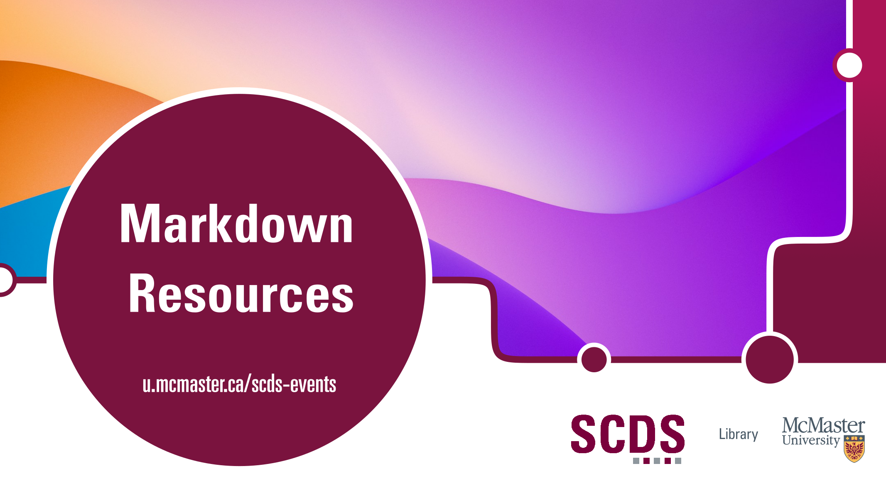

<!-- 
This will be the home page of your module. It should give a small introduction to the student about the workshop topic.
Add, edit, or remove any content below for the workshop in question. -->

<!-- Title slide image. Replace img src with your own, or comment this out. -->

<!-- Main header -->
# Markdown Resources

This page provides some Markdown elements commonly used by the Sherman Centre's workshop websites.

The [Kitchen Sink](kitchen_sink) page contains the more basic Markdown elements, such as showing how to create headers or italicize text.

The [Common Elements](common_elements) page contains some longer elements, such as a basic template for creating input output code blocks and a small guide on using H5P for interactive widgets.

## Land Acknowledgement

<!-- Grabs the default SCDS land acknowledgment. If you want to use a custom one, replace this line with it. -->
